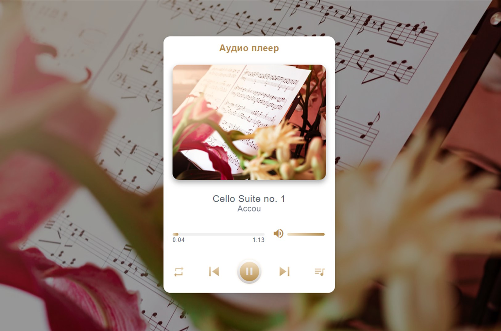
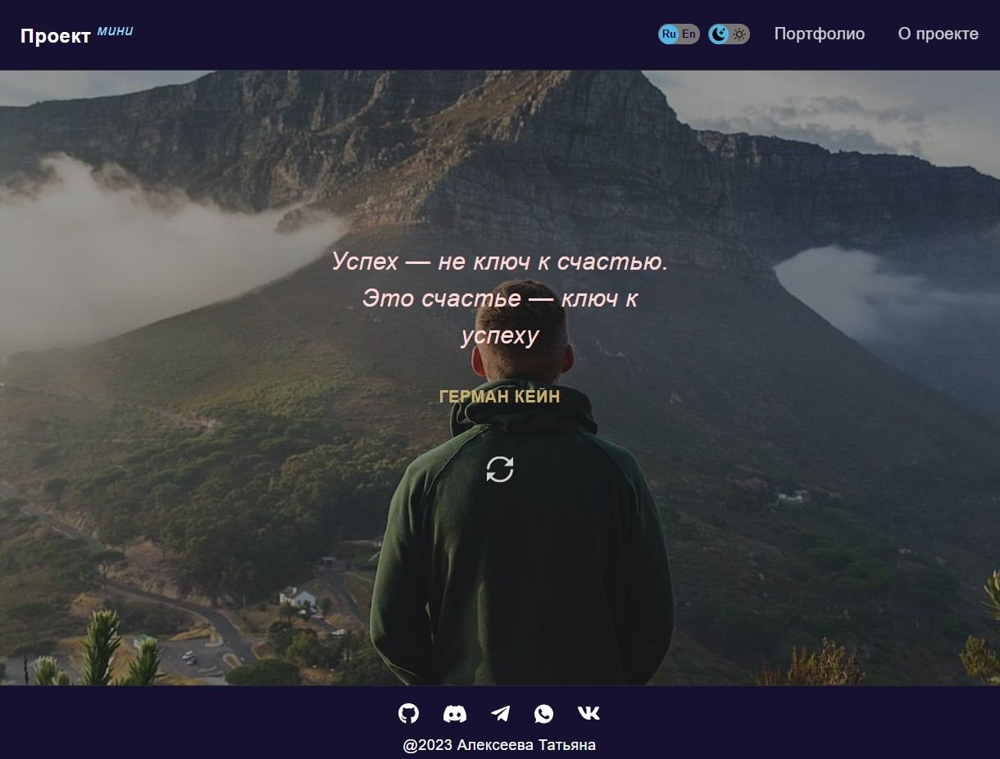

# Аудио плеер

Музыкальный плеер, позволяющий по очереди проигрывать музыкальные треки или перелистывать их кликами по кнопкам. Каждому музыкальному треку соответствует определённое фоновое изображение.

## **Описание проекта**

- Есть кнопка Play/Pause, при клике по которой можно запустить или остановить проигрывание аудиотрека.
- При кликах по кнопкам "Вперёд" и "Назад" переключается проигрываемый аудиотрек. Аудиотреки пролистываются по кругу - после последнего идёт первый.
- При смене аудиотрека меняется изображение - обложка аудиотрека.
- Прогресс-бар отображает прогресс проигрывания текущего аудиотрека. При перемещении ползунка вручную меняется текущее время проигрывания аудиотрека.
- Отображается продолжительность аудиотрека и его текущее время проигрывания.
- Список треков можно увидеть в плей листе, трек, который в данный момент проигрывается, выделяется стилем
- После окончания проигрывания первого трека, автоматически запускается проигрывание следующего. Треки проигрываются по кругу: после последнего снова проигрывается первый.
- Есть возможность установить режим при котором будет постоянно проигрываться один и тот же трек, либо треки в случайном порядке.
- Присутствует регулятор громкости и взможность полностью отключить звук.

## **Стек технологий**

## [**Демо**](https://alekseeva-t-v.github.io/player/)

